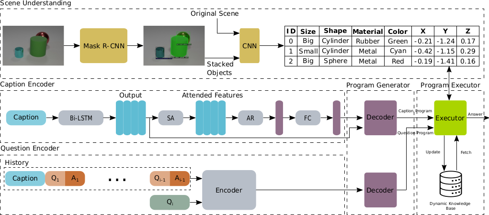
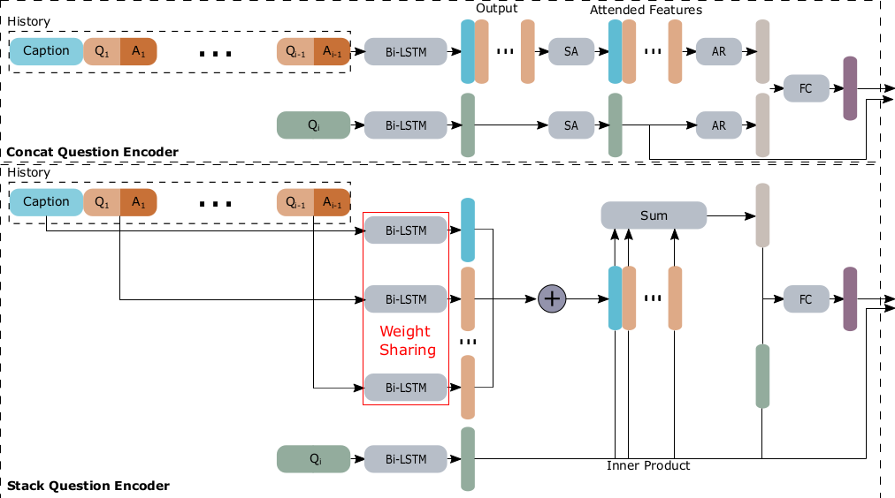

# NSVD

This repository contains the official code of the paper:

## Neuro-Symbolic Visual Dialog [[PDF](TODO)]

[Adnen Abdessaied](https://adnenabdessaied.de), [Mihai Bace](https://perceptualui.org/people/bace/), [Andreas Bulling](https://perceptualui.org/people/bulling/)  
**Oral Presentaion / Poster**  
International Conferenc on Computational Linguistics (COLING), 2022 / Gyeongju, Republic of Korea.

If you find our code useful or use it in your own projects, please cite our paper:

```
TODO
```

# Abstract

We propose Neuro-Symbolic Visual Dialog (NSVD) —the first method to combine deep learning and symbolic program execution for multi-round visually-grounded reasoning. NSVD significantly outperforms existing purely-connectionist methods on two key challenges inherent to visual dialog: long-distance co-reference resolution as well as vanishing question-answering performance. We demonstrate the latter by proposing a more realistic and stricter evaluation scheme in which we use predicted answers for the full dialog history when calculating accuracy. We describe two variants of our model and show that using this new scheme, our best model achieves an accuracy of 99.72% on CLEVR-Dialog —a relative improvement of more than 10% over the state
of the art —while only requiring a fraction of training data. Moreover, we demonstrate that our neuro-symbolic models have a higher mean first failure round, are more robust against incomplete dialog histories, and generalise better not only to dialogs that are up to three times longer than those seen during training but also to unseen question types and scenes.

# Method

<figure>
    <p align="center"></
    <figcaption>Overview of our method NSVD.</figcaption>
</figure>

<figure>
    <p align="center"></
    <figcaption>Overview of concat and stack encoders.</figcaption>
</figure>

# Requirements

- PyTorch 1.3.1
- Python 3.6
- Ubuntu 18.04

# Raw Data

## Scene Data

We used CLEVR and Minecraft images in this project. The raw images have a large footprint and we won't upload them. However, we provide their json file as well as their derendedred versions:

- Original clevr-dialog training and validation raw scenes: [⬇](https://dl.fbaipublicfiles.com/clevr/CLEVR_v1.0.zip)
- Raw scenes we used in our experiments: [⬇](https://1drv.ms/u/s!AlGoPLjLV-BOh1fdB30GscvRnFAt?e=Xtorzr)
- All derendered scenes: [⬇](https://1drv.ms/u/s!AlGoPLjLV-BOh0d00ynwnXQO14da?e=Ub6k33)

## Dialog Data

The dialog data we used can be found here [⬇](https://1drv.ms/u/s!AlGoPLjLV-BOhzaYs3s2qSLbGTL_?e=oGGrxr)  
You can also create your own data using the ``generate_dataset.py`` script.

# Preprocessing

## Scenes

The derendered scenes do not need any further preprocessing and can be diretly used with our neuro-symbolic executor.

## Dialogs

To preprocess the dialogs, follow these steps:

```bash
cd preprocess_dialogs
```

For the stack encoder, execute

```bash
python preprocess.py --input_dialogs_json <path_to_raw_dialog_file> --input_vocab_json '' --output_vocab_json <path_where_to_save_the_vocab> --output_h5_file <path_of_the_output_file> --split <train/val/test> --mode stack
```

For the concat encoder, execute

```bash
python preprocess.py --input_dialogs_json <path_to_raw_dialog_file> --input_vocab_json '' --output_vocab_json <path_where_to_save_the_vocab> --output_h5_file <path_of_the_output_file> --split <train/val/test> --mode concat
```

# Training

First, change directory

```bash
cd ../prog_generator
```

## Caption Program Parser

To train the caption parser, execute

```bash
python train_caption_parser.py --mode train --run_dir <experiment_dir> --res_path <path_to_store_results> --dataPathTr <path_to_preprocessed_training_data> --dataPathVal <path_to_preprocessed_val_data> --dataPathTest <path_to_preprocessed_test_data> --vocab_path <path_where_to_save_the_vocab>
```

## Question Program Parser

To train the question program parser with the stack encoder, execute

```bash
python train_question_parser.py --mode train --run_dir <experiment_dir> --text_log_dir <log_dir_path> --dataPathTr <path_to_preprocessed_training_data> --dataPathVal <path_to_preprocessed_val_data> --dataPathTest <path_to_preprocessed_test_data> --scenePath <path_to_derendered_scenes> --vocab_path <path_where_to_save_the_vocab> --encoder_type 2
```

To train the question program parser with the concat encoder, execute

```bash
python train_question_parser.py --mode train --run_dir <experiment_dir> --text_log_dir <log_dir_path> --dataPathTr <path_to_preprocessed_training_data> --dataPathVal <path_to_preprocessed_val_data> --dataPathTest <path_to_preprocessed_test_data> --scenePath <path_to_derendered_scenes> --vocab_path <path_where_to_save_the_vocab> --encoder_type 1
```

## Baselines

- [MAC-XXX](https://github.com/ahmedshah1494/clevr-dialog-mac-net/tree/dialog-macnet)

- [HCN](https://github.com/jojonki/Hybrid-Code-Networks)

# Evaluation

To evaluate using the *Hist+GT* scheme, execute

```bash
python train_question_parser.py --mode test_with_gt --run_dir <experiment_dir> --text_log_dir <log_dir_path> --dataPathTr <path_to_preprocessed_training_data> --dataPathVal <path_to_preprocessed_val_data> --dataPathTest <path_to_preprocessed_test_data> --scenePath <path_to_derendered_scenes> --vocab_path <path_where_to_save_the_vocab> --encoder_type <1/2> --questionNetPath <path_to_pretrained_question_parser> --captionNetPath <path_to_pretrained_caption_parser> --dialogLen <total_number_of_dialog_rounds> --last_n_rounds <number_of_last_rounds_to_considered_in_history>
```

To evaluate using the *Hist+Pred* scheme, execute

```bash
python train_question_parser.py --mode test_with_pred --run_dir <experiment_dir> --text_log_dir <log_dir_path> --dataPathTr <path_to_preprocessed_training_data> --dataPathVal <path_to_preprocessed_val_data> --dataPathTest <path_to_preprocessed_test_data> --scenePath <path_to_derendered_scenes> --vocab_path <path_where_to_save_the_vocab> --encoder_type <1/2> --questionNetPath <path_to_pretrained_question_parser> --captionNetPath <path_to_pretrained_caption_parser> --dialogLen <total_number_of_dialog_rounds> --last_n_rounds <number_of_last_rounds_to_considered_in_history>
```

# Results

We achieve new state-of-the-art performance on clevr-dialog.

## Hist+GT

| <center>Model</center> | <center>Accurcy</center> | <center>NFFR</center> |
| :---: | :---: | :---: |
|  MAC-CQ                   | 97.34 | 0.92 |
|  + CAA                    | 97.87 | 0.94 |
|  + MTM                    | 97.58 | 0.92 |
|  HCN                      | 75.88 | 0.34 |
|  **NSVD-concat (Ours)**   | 99.59 | 0.98 |
|  **NSVD-stack (Ours)**    | **99.72** | **0.99** |

## Hist+Pred

| <center>Model</center> | <center>Accurcy</center> | <center>NFFR</center> |
| :---: | :---: | :---: |
|  MAC-CQ                   | 41.10 | 0.15 |
|  + CAA                    | 89.39 | 0.75 |
|  + MTM                    | 70.39 | 0.46 |
|  HCN                      | 74.42 | 0.32 |
|  **NSVD-concat (Ours)**   | 99.59 | 0.98 |
|  **NSVD-stack (Ours)**    | **99.72** | **0.99** |

We refer to our paper for more results and experiments.

# Acknowledgements

We thank [Ahmed Shah](https://www.linkedin.com/in/mahmedshah/) for his MAC-XXX implemetation, [Junki Ohmura](https://www.linkedin.com/in/junki/) for his HCN implemantation, [Jiayuan Mao](https://jiayuanm.com/) for providing us with the minecraft images, and finally [Satwik Kottur](https://satwikkottur.github.io/) for his clevr-dialog [codebase](https://github.com/satwikkottur/clevr-dialog).

# Contributors

- [Adnen Abdessaied](https://adnenabdessaied.de)

For any questions or enquiries, don't hesitate to contact the above contributor.
